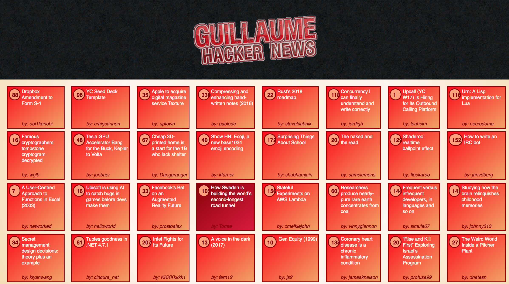
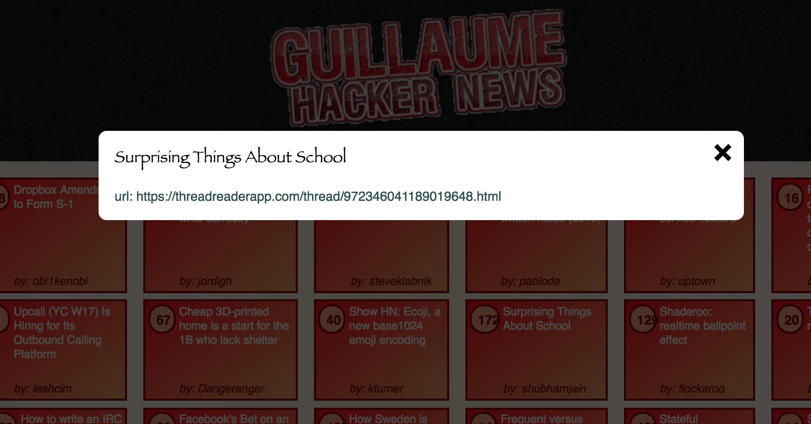
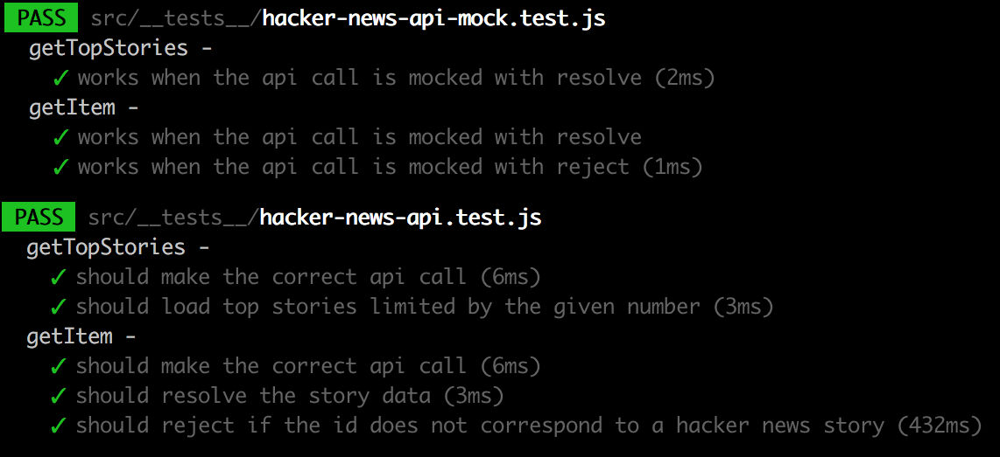
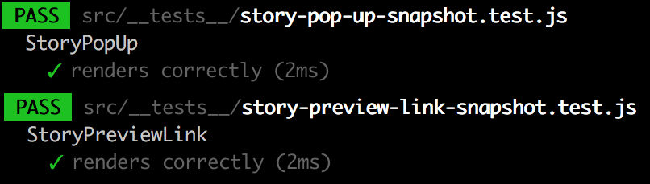

:newspaper: Hacker News Feed :newspaper:
===
This is Guillaume's Hacker News Feed:

The popular news site Hacker News (HN) run by YCombinator provides interesting links to news articles and blog posts that are related to information technology. This project is a more eye-pleasing version of the top 500 stories listed on HN using their official API.
On a story click, a popup expands with information regarding the story; in the absence of text being given with the API, I replace it with the url of the story.


Technologies used:
----
- JavaScript
- ES6 syntax
- create-react-app
- React
- Prop-types
- Axios with JavaScript promises
- Hacker News API in partnership with with Firebase.
- Jest
- React-test-renderer
- Lodash
- CSS
- Flexbox
- HTML / JSX
- BEM

Desktop preview:
----






Tests preview:
----





To come

How to run it:
----
```
git git@github.com:GBouffard/Hacker-news-feed.git
cd hacker-news-feed
./build.sh
```
PS: the script will ask to choose options regarding running Jest tests; Press a to run all tests, then q to quit the test suite.


Methodology:
----
- I first scaffolded the app through react-create-app.
- I started with unit logic tests (mock and then real API) and based the api logic on how it is supposed to work.
- I then started with the React hierarchy to render what is expected from the project, adding css and styling as I went along. I even added some quick wins/changes to accommodate to responsive design.
- I added a spinner gif in order to wait for the api 's response. Ideally the stories would load once received but for implementation purposes I made the spinner last 5 seconds.

What I learnt:
----
- A call to an API within a major project is something that I did not have to do for a long time so it was challenging and interesting to make it work.
- the Use of Axios to access the HN API through promise was a first for me.
- The use of a popup box/overlay was also a first implementation.

What to improve:
----
- I noticed only towards the end of the project that the columns widths can after a certain amount of time inexplicably grow! I worked for most of the project with only 10 top stories to start small. I would need to spend time investigating why this behaviour is happening. It also unfortunately make my responsive design irrelevant when this behaviour happens.
- For some reasons the enzyme, react-test-renderer and Chai set-up/versioning conflicted; answers found on StackOverflow and Github didn't resolve so after a while, instead of being stuck I decided to skip integration tests and delay additional debugging to later. I like TDD so have investigated other testing frameworks to use for functional tests but didn't have the time to try them yet. I added snapshot tests at the end to add additional security regarding the strength of the isolated React Components.
- There might be more efficient ways to access data from the API and I am keen to learn about them; also it would be best to load the content once the response comes back instead of a fixed 5 seconds delay.
- sass or less compiling instead of css could also be added.
- Component state is fine as a MVP, but an application architecture such as Flux or Redux would be a great addition.
- A continuous integration tool could also be added.
- The project is still open and I will keep improving it as I find the time to. Suggestions are more than welcome.